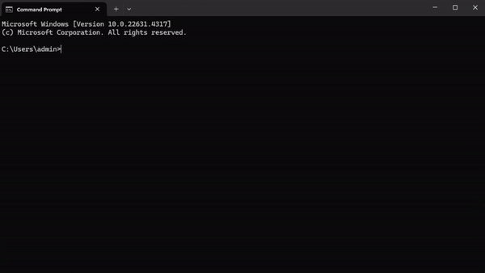

# Statistic Calculator App
<p align="center">
  
</p>
<p>
   
   
   
   
   
</p>

## Table of Contents
- [Technologies](#technologies)
- [Overview](#overview)
- [Documentation](#documentations)
- [Installation and Usage](#installation-and-usage)
- [Future Enhancements](#future-enhancements)
- [Feedback and Contributions](#feedback-and-contributions)
- [License](#license)
- [Contacts](#contacts)

## Technologies
<p>
   
   
   
   
   
</p>

## Overview
[Click here to access the app](https://stats-calculator.streamlit.app/)


Welcome to the **Statistic Calculator** app! This Streamlit-powered application provides a comprehensive suite of statistical tools and models for data analysis, hypothesis testing, and machine learning. The app is divided into several sections, covering both discrete and continuous distributions, margin of error (MOE) calculations, hypothesis tests, statistical theorems, and machine learning models.

Whether you're looking to explore binomial distributions, run hypothesis tests, or apply machine-learning techniques like gradient descent, this app has you covered!

---

## Documentations

The mathematical features, folder structure of the software is documented [here](./documentation.md)

## Installation and Usage

1. **Clone the Repository**
   ```bash
   git clone https://github.com/MarkPhamm/Stats-Calculator.git
   ```

2. **Create a Virtual Environment**
   ```bash
   python -m venv .venv
   ```

3. **Activate the Virtual Environment**
   - On Windows:
     ```bash
     .venv\Scripts\activate
     ```
   - On macOS and Linux:
     ```bash
     source .venv/bin/activate
     ```

4. **Install Dependencies**
   ```bash
   pip install -r requirements.txt
   ```

5. **Run the Application**
   ```bash
   streamlit run Introduction.py
   ```
---

## Future Enhancements

- Add support for additional distributions and hypothesis tests.
- Expand machine learning capabilities to include classification models.
- Enhance visualization for deeper insights into statistical data.

---

## Feedback and Contributions

We've made every effort to implement all the main aspects of the project in the best possible way. However, the development journey doesn't end here, and your input is crucial for our continuous improvement.

> [!IMPORTANT]
> Whether you have feedback on features, have encountered any bugs, or have suggestions for enhancements, we're eager to hear from you. Your insights help us make the Stats-Calculator more robust and user-friendly.

Please feel free to contribute by [submitting an issue](https://github.com/MarkPhamm/Stats-Calculator/issues). Each contribution helps us grow and improve.

We appreciate your support and look forward to making our product even better with your help!

---

## License

[MIT](./LICENSE)

For non-commercial use, this product is available for free.

---

## Contacts

Developed by [Minh (Mark) Pham](https://www.linkedin.com/in/minhbphamm/), this app is designed to provide a comprehensive toolkit for both students and professionals in statistics and data science.

Feel free to reach out at [minh.b.pham@tcu.edu](mailto:minh.b.pham@tcu) for any questions or suggestions!

[Back to top](#top)

